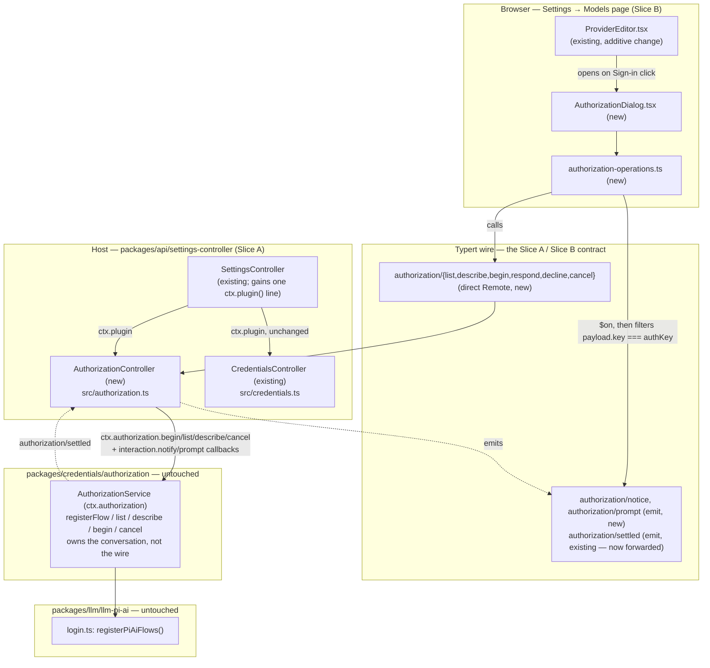
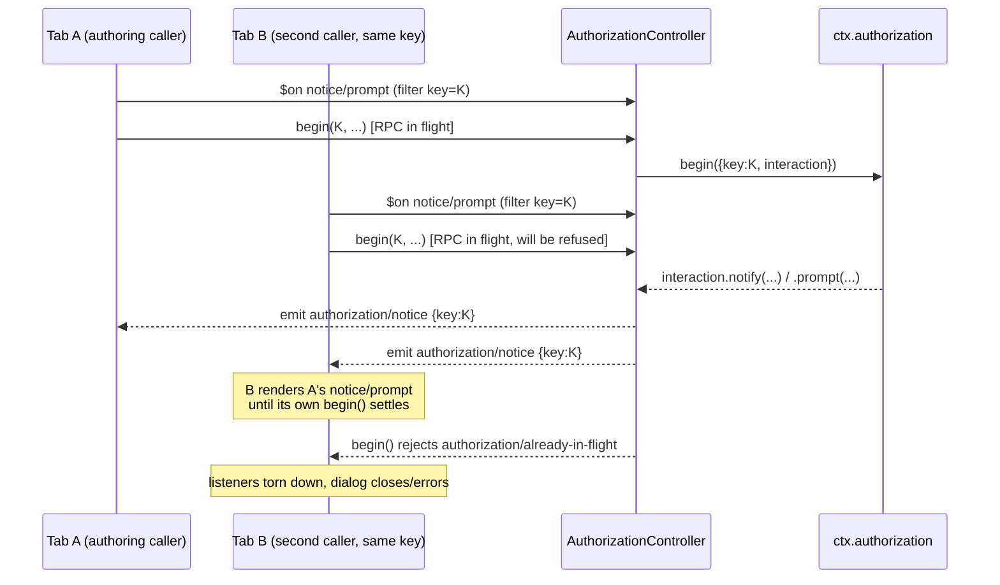

# Agent Note: Browser OAuth sign-in via ctx.authorization, and a keyless web-search default

Status: proposed

## Problem

DSH's top-level agent can already run entirely on a user's Claude Pro/Max
subscription: the `anthropic` provider in the installed `@earendil-works/pi-ai`
package declares both an `oauth` and an `api-key` auth method, and
`packages/llm/llm-pi-ai/src/login.ts`'s `registerPiAiFlows()` already
registers a working `ctx.authorization` flow for it (`loginMethods()` /
`registerPiAiFlows()`). A user's `settings.yaml` can already point
`agent-default-model` at `{ provider: anthropic, model: claude-sonnet-5 }`
through `llm-pi-ai`.

Two gaps stop a user from *reaching* that flow, and a third makes the
agent's other DeepSeek default leak into "zero API keys" even after the LLM
default is fixed:

1. **No client-facing RPC exposes `ctx.authorization` at all.** Nothing under
   `packages/api/remotes` or `packages/api/settings-controller` calls
   `ctx.authorization.list()` / `.describe()` / `.begin()` / `.cancel()`, so a
   browser has no way to discover that an `oauth` method exists for a
   provider, let alone drive the sign-in conversation
   (`packages/credentials/authorization/src/index.ts`,
   `packages/credentials/authorization/src/types.ts`).
2. **`ProviderEditor.tsx` is hardcoded to a single write-only API-key
   input.** Its own file-level doc comment states this is deliberate
   original scope; it never branches on `AuthorizationMethod[]` and has no
   OAuth affordance
   (`packages/client/ui-settings-models/src/client/ProviderEditor.tsx`).
3. **The web-search tool hard-defaults to a DeepSeek route.**
   `packages/bundle/base/cordis.patch.yml` pins `web.searchProvider:
   deepseek-official` and mounts `web-search-deepseek` with
   `apiKeyEnv: DEEPSEEK_API_KEY`, so a deployment with no DeepSeek credential
   gets a DeepSeek-flavored failure the moment the model calls `web_search`,
   even though nothing about search *requires* DeepSeek specifically.

This note proposes closing all three gaps with the smallest change that
fits each subsystem's existing conventions.

## Proposal

### 1. RPC contract — expose `ctx.authorization` to the browser

New Host service `AuthorizationController` in
`packages/api/settings-controller/src/authorization.ts`, structured exactly
like the existing `CredentialsController`
(`packages/api/settings-controller/src/credentials.ts`): extends
`TypertRemoteService`, namespace `'authorization'`, mounted from
`SettingsController`'s constructor via `ctx.plugin(AuthorizationController)`
right beside `ctx.plugin(CredentialsController)`.

**Wire key shape.** Every method takes a single `key: string` — the joined
`<scope>/<id>` form (`llm-pi-ai/anthropic`) — rather than two `scope`/`id`
parameters. The controller re-brands it server-side with the seam's own
`parseCredentialKey()` (`packages/credentials/credentials/src/index.ts`),
exactly as `CredentialsController.set()` re-brands a plain `ref: string`
with `credentialRef()` rather than trusting a pre-branded value from the
wire. This means the client never needs to import the branding helper — it
already has `namespace.ns` and `props.provider` in `ProviderEditor.tsx` and
can build `` `${namespace.ns}/${props.provider}` `` as a plain string.

```ts
// packages/api/settings-controller/src/authorization.ts

const keySchema = z.string().regex(/^[a-z][a-z0-9-]*\/[a-z][a-z0-9-]*$/)

class AuthorizationController extends TypertRemoteService {
  constructor(ctx: Context) {
    super(ctx, 'authorizationController', { namespace: 'authorization' })
  }

  @Remote
  list(): AuthorizationEntryView[]                                    // no params

  @Remote
  describe(key: string): AuthorizationEntryView | undefined

  @Remote
  begin(key: string, method: string | undefined, signal: AbortSignal): Promise<AuthorizationOutcomeView>

  @Remote
  respond(key: string, promptId: string, value: string): void

  @Remote
  decline(key: string, promptId: string): void

  @Remote
  cancel(key: string): void
}
```

`AuthorizationEntryView` is `AuthorizationEntry` from
`@deepseek-ai/dsh-authorization/types` projected field-by-field (same
defensive copy `projectCredentialInfo` does for `CredentialInfo`), so a
flow object with unexpected enumerable properties can't leak onto the wire.
`AuthorizationOutcomeView` is `{ status: 'authorized' | 'cancelled' }`
verbatim (`AuthorizationOutcome` is already wire-safe).

**Error mapping** (new `RemoteErrorDetailsMap` entries declared beside the
controller, same pattern as `credentials/rejected`):

| Seam throw / condition | `RemoteError` code |
|---|---|
| `AuthorizationError` code `NO_FLOW` | `authorization/no-flow` |
| `AuthorizationError` code `UNKNOWN_METHOD` | `authorization/unknown-method` |
| `AuthorizationError` code `ALREADY_IN_FLIGHT` | `authorization/already-in-flight` |
| `AuthorizationError` code `NOT_COMMITTED` | `authorization/not-committed` |
| `respond`/`decline` name a `(key, promptId)` with no pending prompt | `authorization/unknown-prompt` |
| malformed `key` string | `gateway/bad-request` |
| `begin()`'s own `signal` already aborted | `gateway/cancelled` |
| anything else | `gateway/internal` |

`cancel(key)` is a **second, separate call** — not derived from `begin()`'s
own `signal` — because `ctx.authorization.cancel()`'s own doc comment
already names this exact requirement: "a request/response transport
answers a Cancel button on a second call, with no handle on the first
one's signal." `AuthorizationDialog` (below) issues both: it aborts its
local `begin()` call's `AbortSignal` *and* calls `cancel(key)`, so the fix
holds regardless of whether the RPC transport forwards a caller-aborted
signal to the in-flight Host call.

### 2. Interaction bridge — how notify/prompt reach the browser mid-`begin()`

`ctx.authorization.begin()` is one long-running async call whose
`AuthorizationInteraction.notify()`/`.prompt()` need to reach the browser
*while* the RPC call is still pending, and `.prompt()` needs an answer
relayed back before `begin()` can continue. Two existing patterns were
considered and one was rejected on a concrete type-level finding:

**Rejected: reuse the `approval/request` / `user-questions/request`
waterfall-forwarding machinery.** Traced `TypertWaterfallEvent` in
`packages/typert/protocol/src/types.ts`: forwarding a Cordis event in
`'waterfall'` mode requires its request type to satisfy
`TypertAgentScopedRequest` — literally, the request object must carry an
`agent` field typed as `TypertProjectedContextSubject`. This is a hard,
Agent-scope-specific constraint baked into `TypertForwardingMode` at the
type level, not a convention `approval/request` happens to follow. An
authorization attempt has no `Agent` — it's a settings-page conversation —
so it cannot satisfy this constraint without extending the protocol layer
itself to recognize a new kind of scoped subject. That's a bigger, riskier
change than this task's scope.

**Adopted: one-way `emit` events plus a dedicated answer-back RPC call.**
Two new Cordis events, declared as a Remote-forwarding bridge in
`packages/api/settings-controller/src/authorization.ts` itself (**not** in
`packages/credentials/authorization`, which stays free of any wire concept
per its own module doc — "the seam owns the conversation, never the
protocol"):

```ts
declare module '@deepseek-ai/cordis' {
  interface Events {
    /** @mode emit */
    'authorization/notice'(payload: { key: string; notice: AuthorizationNotice }): void
    /** @mode emit */
    'authorization/prompt'(payload: { key: string; promptId: string; prompt: WireAuthorizationPrompt }): void
  }
}
```

`WireAuthorizationPrompt` is `AuthorizationPrompt` minus its `signal`
field — an `AbortSignal` can't cross the wire. The controller keeps the
real `prompt.signal` server-side and reacts to it itself (see below), so
the *contract* ("this one prompt can be withdrawn without ending the
attempt") is preserved even though the object shape sent over the wire is
smaller.

The existing `authorization/settled` event (already declared in
`packages/credentials/authorization/src/index.ts`) is forwarded unchanged
in `'emit'` mode too, so any open tab's entry/`inFlight` state refreshes
when an attempt — started from *any* tab — finishes.

`AuthorizationController.begin()`'s implementation:

```ts
async begin(keyString: string, method: string | undefined, signal: AbortSignal): Promise<AuthorizationOutcomeView> {
  const key = parseKeyOrThrow(keyString)                    // -> gateway/bad-request
  const pending = new Map<string, PromiseWithResolvers<string>>()
  this.pendingByKey.set(key, pending)
  try {
    const outcome = await this.ctx.authorization.begin({
      key, method, signal,
      interaction: {
        notify: (notice) => { this.ctx.emit('authorization/notice', { key, notice }) },
        prompt: (prompt) => {
          const promptId = randomUUID()
          const resolvers = Promise.withResolvers<string>()
          pending.set(promptId, resolvers)
          const wire = { kind: prompt.kind, message: prompt.message, ...restOf(prompt) }  // drop `signal`
          this.ctx.emit('authorization/prompt', { key, promptId, prompt: wire })
          prompt.signal?.addEventListener('abort', () => {
            pending.delete(promptId)
            resolvers.reject(new AuthorizationDeclinedError())   // withdraw just this prompt
          }, { once: true })
          return resolvers.promise
        },
      },
    })
    return outcome
  } catch (error) {
    throw mapAuthorizationError(error)                        // table above
  } finally {
    for (const [, resolvers] of pending) resolvers.reject(new Error('authorization attempt ended'))
    this.pendingByKey.delete(key)
  }
}

respond(keyString: string, promptId: string, value: string): void {
  const key = parseKeyOrThrow(keyString)
  const resolvers = this.pendingByKey.get(key)?.get(promptId)
  if (resolvers === undefined) throw new RemoteError('authorization/unknown-prompt', ..., { key: keyString, promptId })
  this.pendingByKey.get(key)!.delete(promptId)
  resolvers.resolve(value)
}

decline(keyString: string, promptId: string): void {
  const key = parseKeyOrThrow(keyString)
  const resolvers = this.pendingByKey.get(key)?.get(promptId)
  if (resolvers === undefined) throw new RemoteError('authorization/unknown-prompt', ..., { key: keyString, promptId })
  this.pendingByKey.get(key)!.delete(promptId)
  resolvers.reject(new AuthorizationDeclinedError())
}
```

**Multi-tab correctness.** `emit`-mode forwarded events broadcast to every
connected client, same as `credentials/reference-updated` today. Each
tab's client-side listener filters on `payload.key === <the key this tab
is currently authorizing>` and no-ops otherwise — the same
filter-or-ignore shape `answerQuestion`/`answerApproval` already use in
`packages/client/ui-user-questions/src/client/index.ts` /
`packages/client/ui-approval/src/client/index.ts`, just keyed by
`CredentialKey` equality instead of Agent scope. Because
`ctx.authorization.begin()` already enforces one attempt per key
process-wide, at most one tab is ever the legitimate answerer for a given
key at a time, so no arbitration beyond this filter is needed.

### 3. Forwarded-event allowlist and type re-exports

`packages/api/remotes/src/remote-events.ts` — add three entries to
`API_REMOTE_FORWARDED_EVENTS`:

```ts
{ event: 'authorization/notice', mode: 'emit' },
{ event: 'authorization/prompt', mode: 'emit' },
{ event: 'authorization/settled', mode: 'emit' },
```

`packages/api/remotes/src/client/index.ts` — re-export the wire-safe
authorization types from `@deepseek-ai/dsh-authorization/types` the same
way `CredentialInfo` is re-exported from `@deepseek-ai/dsh-credentials/types`
today (`AuthorizationEntry`, `AuthorizationMethod`, `AuthorizationNotice`,
`AuthorizationOutcome`, `AuthorizationPrompt`, `AuthorizationPromptOption`,
`AuthorizationStatus`), and add the type-only `import type {} from
'@deepseek-ai/dsh-authorization/types'` / settings-controller `/remote`
imports needed for the two new events and the `authorization` namespace to
type-check through `ApiRemoteForwardedEvent`, mirroring how
`dsh-user-questions/types` is threaded through for `user-questions/request`.

### 4. Client operations layer

New `packages/client/ui-settings-models/src/client/authorization-operations.ts`,
parallel to the existing `operations.ts`:

```ts
export interface AuthorizationOperations {
  describeAuthorization(key: string): Promise<AuthorizationEntry | undefined>
  beginAuthorization(
    key: string,
    method: string | undefined,
    signal: AbortSignal,
    handlers: {
      onNotice(notice: AuthorizationNotice): void
      onPrompt(promptId: string, prompt: AuthorizationPrompt): void
    },
  ): Promise<AuthorizationOutcome>
  respondAuthorization(key: string, promptId: string, value: string): Promise<string | undefined>
  declineAuthorization(key: string, promptId: string): Promise<string | undefined>
  cancelAuthorization(key: string): Promise<void>
}

export function createAuthorizationOperations(ctx: ClientContext): AuthorizationOperations {
  return {
    describeAuthorization: async (key) => {
      const response = await ctx.remote.authorization.describe(key)
      return response.ok ? response.value : undefined
    },
    beginAuthorization: async (key, method, signal, handlers) => {
      const offNotice = ctx.remote.$on('authorization/notice', (payload) => {
        if (payload.key === key) handlers.onNotice(payload.notice)
      })
      const offPrompt = ctx.remote.$on('authorization/prompt', (payload) => {
        if (payload.key === key) handlers.onPrompt(payload.promptId, payload.prompt)
      })
      try {
        const response = await ctx.remote.authorization.begin(key, method, signal)
        if (!response.ok) throw response.error
        return response.value
      } finally {
        offNotice()
        offPrompt()
      }
    },
    respondAuthorization: async (key, promptId, value) => {
      const response = await ctx.remote.authorization.respond(key, promptId, value)
      return response.ok ? undefined : response.error.message
    },
    declineAuthorization: async (key, promptId) => {
      const response = await ctx.remote.authorization.decline(key, promptId)
      return response.ok ? undefined : response.error.message
    },
    cancelAuthorization: async (key) => {
      await ctx.remote.authorization.cancel(key)
    },
  }
}
```

`packages/client/ui-settings-models/src/client/index.ts`: add
`'remote.authorization'` to the plugin's `inject`; bind
`createAuthorizationOperations(ctx)` beside `createModelsOperations(ctx)`
and pass it down alongside `operations`; add
`ctx.remote.$on('authorization/settled', refreshModels)` to the existing
pushed-invalidations disposer list next to `credentials/reference-updated`.

### 5. Client UI plan — `ProviderEditor.tsx`

Update the file's own top-of-file doc comment: the API-key input is no
longer the *only* primary field — the card also offers an OAuth affordance
when the pi-ai layout's registered flow declares an `oauth` method. The
password input is never removed or hidden: API-key entry keeps working
unconditionally for any provider/user that wants it.

```ts
// inside ProviderEditor, alongside the existing keyRef/keyState wiring
const authKey = layout === 'pi-ai' ? `${namespace.ns}/${props.provider}` : undefined
const [authEntry, setAuthEntry] = useState<AuthorizationEntry | undefined>(undefined)
const [authDialogOpen, setAuthDialogOpen] = useState(false)

useEffect(() => {
  if (authKey === undefined) { setAuthEntry(undefined); return }
  let stale = false
  void operations.describeAuthorization(authKey).then((entry) => { if (!stale) setAuthEntry(entry) })
  return () => { stale = true }
}, [operations, authKey])
```

Render, inside `curatedFields`, only for `family === 'pi-ai'`, directly
above the existing password `<input>`:

- `authEntry === undefined || authEntry.methods.length === 0` → render
  nothing new (today's behavior, byte-for-byte).
- otherwise → a compact sign-in row:
  - one method (the common case — pi-ai's `anthropic` provider offers just
    `oauth`): a single button labeled with that method's own `label`
    (e.g. "Sign in with Anthropic (Claude Pro/Max)" — the label already
    comes from `oauth.loginLabel ?? oauth.name` in
    `packages/llm/llm-pi-ai/src/login.ts`, so no new copy is invented
    here).
  - more than one method: a small method picker (radio group) plus one
    "Continue" button.
  - `disabled={disabled || authEntry.inFlight}`; while `inFlight`, the
    button reads e.g. "Signing in…" — the same treatment `keyLocked`
    already gets for the password field.
- clicking opens `<AuthorizationDialog>` (new component, §6) with
  `authKey`, the chosen method id, `authEntry.label`, `operations`, `t`.
- `AuthorizationDialog`'s `onClose`:
  - `{ status: 'authorized' }` → re-run the existing `describeCredential`
    effect and the new `describeAuthorization` effect (or just re-invoke
    their setters) so the card immediately reflects "already configured"
    and drops the sign-in affordance's busy state; the API-key field
    (`keyDraft`) is left untouched — OAuth sign-in never writes it.
  - `{ status: 'cancelled' }` → close quietly, no `failure` banner (a
    decline is an outcome, not a breakage — matches the seam's own
    contract).
  - a thrown `RemoteError` → surface `error.message` in the same
    `styles['error']` slot the card already uses for settings/credential
    write failures, not a new error path.

### 6. New component — `AuthorizationDialog`

`packages/client/ui-settings-models/src/client/AuthorizationDialog.tsx`.

Props: `authKey: string`, `method: string`, `label: string`,
`operations: AuthorizationOperations`, `t`, `onClose: (outcome:
{ status: 'authorized' | 'cancelled' } | undefined) => void` (`undefined`
= dismissed before `begin()` settled).

State: `notice: AuthorizationNotice | undefined`, `pendingPrompt:
{ promptId: string; prompt: AuthorizationPrompt } | undefined`,
`answerDraft: string`, `busy: boolean`, `failure: string | undefined`.

On mount: create an `AbortController`; call
`operations.beginAuthorization(authKey, method, controller.signal,
{ onNotice: setNotice, onPrompt: (promptId, prompt) => { setPendingPrompt({ promptId, prompt }); setAnswerDraft('') } })`;
on resolve → `onClose(outcome)`; on reject (not from the local abort) →
`setFailure(error.message)`.

Render:

- `notice.message`; when present, `notice.url` as a real
  `<a target="_blank" rel="noreferrer">` and `notice.code` in a copyable
  `<code>` element — this is the literal "open this URL, enter this code"
  affordance the confirmed requirement calls for.
- when `pendingPrompt` is set, by `prompt.kind`:
  - `text` / `secret` → one labeled `<input type={secret ? 'password' :
    'text'}>` bound to `answerDraft` (placeholder from
    `prompt.placeholder`), a Submit button calling
    `operations.respondAuthorization(authKey, promptId, answerDraft)`, and
    a Decline button calling
    `operations.declineAuthorization(authKey, promptId)`.
  - `select` → one button per `prompt.options[]`, each calling
    `respondAuthorization(authKey, promptId, option.id)` directly (no
    separate submit step), plus a Decline button.
- a persistent Cancel action: aborts the local controller **and** calls
  `operations.cancelAuthorization(authKey)` (see §1's rationale for
  issuing both), then `onClose(undefined)`.
- unmount always aborts the local controller defensively, in case a
  parent re-render tears the dialog down mid-flow.

### Web-search default fix

Traced `dsh-tool-web`'s own module doc
(`packages/web/tool-web/src/index.ts`): "Enablement controls tool
registration; an enabled tool remains visible when its provider is
unavailable and fails with a structured error at execution time." This is
a **deliberate** graceful-degradation design already in place — `web_search`
is always registered when `search: true`, and a missing credential is a
per-call structured failure, never a boot-time crash. Changing that
contract is out of scope for a minimal fix.

Traced `WebRuntime.search()`'s selection rules
(`packages/web/web/src/index.ts`): an *explicitly configured*
`searchProvider` id that resolves to a registered-but-unavailable provider
throws the DeepSeek-flavored `WEB_PROVIDER_CONFIGURED_UNAVAILABLE`; with
**no** id configured, auto-selection over the registered providers throws
the neutral, provider-agnostic `WEB_PROVIDER_UNAVAILABLE` ("no usable web
provider is registered") once none are usable — and never blames a
specific provider.

**Fix:** in `packages/bundle/base/cordis.patch.yml`, delete the
`searchProvider: deepseek-official` line from the `web` row's `config:`
(leave `fetchProvider: http`, which needs no credential and stays
provider-agnostic already). Leave the `web-search-deepseek` row mounted,
unchanged — it still self-registers and becomes the auto-selected provider
the instant a deployment supplies `DEEPSEEK_API_KEY` (via the credential
store or the environment), so existing DeepSeek-key deployments see zero
behavior change. A deployment with **no** search-capable credential at all
now fails `web_search` calls with the honest `WEB_PROVIDER_UNAVAILABLE`
instead of a message that specifically asserts a DeepSeek requirement that
was never actually load-bearing. This is a one-line config change; it
touches neither `web-search-deepseek`'s package nor `tool-web` nor
`ctx.web`'s selection algorithm.

Explicitly **not** attempted here, and named as deferred work rather than
guessed at: a genuinely keyless, Anthropic-OAuth-backed search provider.
`web-search-deepseek`'s own provider already talks to an
"Anthropic-compatible Messages API" using the native `web_search_20250305`
server tool (`packages/web/web-search-deepseek/src/provider.ts`) —
structurally the mechanism a true Anthropic-backed provider would reuse —
but it authenticates with a raw `x-api-key`/`Bearer` string, not an
OAuth-refreshable access token. Wiring it to the same pi-ai `anthropic`
OAuth credential the agent now signs in with is a real new-provider effort
(token refresh, `anthropic-beta` headers, its own credential-resolution
path), not a "smallest correct" fix, and is left as follow-up work.

## Pseudocode

```text
// ── Host: packages/api/settings-controller/src/authorization.ts ──────────

module AuthorizationController extends TypertRemoteService:
  state pendingByKey: Map<CredentialKey, Map<promptId, PromiseWithResolvers<string>>>

  function parseKeyOrThrow(raw: string) -> CredentialKey:
    // TEST: describe("not-a-key") rejects with gateway/bad-request
    // TEST: describe("llm-pi-ai/anthropic") parses to credentialKey('llm-pi-ai','anthropic')
    if not KEY_PATTERN.test(raw): throw RemoteError('gateway/bad-request', ...)
    return parseCredentialKey(raw)

  @Remote list() -> AuthorizationEntryView[]:
    // TEST: list() with zero registered flows returns []
    // TEST: list() reflects a flow registered after this controller mounted
    return ctx.authorization.list().map(projectEntry)

  @Remote describe(key: string) -> AuthorizationEntryView | undefined:
    // TEST: describe() for an unregistered key returns undefined (not a throw)
    // TEST: describe() for a registered key returns its methods[] and inFlight
    return ctx.authorization.describe(parseKeyOrThrow(key)) |> map(projectEntry)

  @Remote async begin(key: string, method: string | undefined, signal) -> AuthorizationOutcomeView:
    // TEST: begin() with an already-aborted signal rejects gateway/cancelled, never reaches ctx.authorization.begin()
    // TEST: begin() for a key with no registered flow rejects authorization/no-flow
    // TEST: begin() naming an offered method other than the flow's first uses that method
    // TEST: begin() naming a method the flow does not offer rejects authorization/unknown-method
    // TEST: begin() while another begin() for the same key is in flight rejects authorization/already-in-flight
    // TEST: a flow's notify() during begin() emits exactly one 'authorization/notice' with this call's key
    // TEST: a flow's prompt() during begin() emits exactly one 'authorization/prompt' with a promptId and no `signal` field
    // TEST: begin() resolves { status: 'authorized' } once the flow commits and the seam observes it
    // TEST: a declined prompt (via decline()) makes begin() resolve { status: 'cancelled' }, not throw
    // TEST: begin() resolving/throwing rejects every prompt still pending for this key (no orphaned resolvers)
    // TEST: a NOT_COMMITTED flow rejects authorization/not-committed
    key' = parseKeyOrThrow(key)
    pending = new Map()
    pendingByKey.set(key', pending)
    try:
      outcome = await ctx.authorization.begin({
        key: key', method, signal,
        interaction: {
          notify(notice): ctx.emit('authorization/notice', { key, notice }),
          prompt(prompt):
            promptId = randomUUID()
            resolvers = PromiseWithResolvers<string>()
            pending.set(promptId, resolvers)
            ctx.emit('authorization/prompt', { key, promptId, prompt: dropSignal(prompt) })
            prompt.signal?.addEventListener('abort', once =>
              pending.delete(promptId)
              resolvers.reject(new AuthorizationDeclinedError()))
            return resolvers.promise,
        },
      })
      return outcome
    catch (error): throw mapAuthorizationError(error)
    finally:
      for (_, resolvers) of pending: resolvers.reject(new Error('authorization attempt ended'))
      pendingByKey.delete(key')

  @Remote respond(key: string, promptId: string, value: string) -> void:
    // TEST: respond() for an unknown (key, promptId) rejects authorization/unknown-prompt
    // TEST: respond() resolves the matching begin()'s pending prompt() promise with `value`
    // TEST: respond() consumes the pending entry — a second respond() with the same promptId rejects authorization/unknown-prompt
    resolvers = pendingByKey.get(parseKeyOrThrow(key))?.get(promptId)
    if resolvers is undefined: throw RemoteError('authorization/unknown-prompt', ...)
    delete entry; resolvers.resolve(value)

  @Remote decline(key: string, promptId: string) -> void:
    // TEST: decline() rejects the pending prompt() with AuthorizationDeclinedError, settling begin() as cancelled
    // TEST: decline() for an unknown (key, promptId) rejects authorization/unknown-prompt
    resolvers = pendingByKey.get(parseKeyOrThrow(key))?.get(promptId)
    if resolvers is undefined: throw RemoteError('authorization/unknown-prompt', ...)
    delete entry; resolvers.reject(new AuthorizationDeclinedError())

  @Remote cancel(key: string) -> void:
    // TEST: cancel() on a key with no in-flight attempt is a harmless no-op
    // TEST: cancel() aborts the in-flight begin(), which resolves { status: 'cancelled' }
    ctx.authorization.cancel(parseKeyOrThrow(key))

// ── Client: packages/client/ui-settings-models/src/client/authorization-operations.ts ──

function createAuthorizationOperations(ctx) -> AuthorizationOperations:
  // TEST: describeAuthorization() for an unknown key resolves undefined, never throws
  // TEST: beginAuthorization() subscribes onNotice/onPrompt filtered by key, ignores other keys' events
  // TEST: beginAuthorization() unsubscribes both listeners once the underlying begin() settles (success, throw, or abort)
  // TEST: respondAuthorization()/declineAuthorization() surface the RemoteError message as a string, mirroring storeCredential's contract
  ...

// ── Client: ProviderEditor.tsx additions ──────────────────────────────────

function ProviderEditor(props):
  // TEST: authKey is undefined (no authorization affordance rendered) for family === 'deepseek'
  // TEST: authKey === `${namespace.ns}/${props.provider}` for family === 'pi-ai'
  // TEST: no sign-in affordance renders while authEntry is undefined or methods.length === 0
  // TEST: exactly one button renders labeled with the single method's own label, when methods.length === 1
  // TEST: the sign-in affordance is disabled and shows a busy label while authEntry.inFlight === true
  // TEST: the password <input> remains present, enabled, and independently submittable regardless of authEntry
  // TEST: on AuthorizationDialog onClose({status:'authorized'}), the card re-describes credential+authorization and drops the busy state
  // TEST: on AuthorizationDialog onClose({status:'cancelled'}), no failure banner appears
  // TEST: on AuthorizationDialog onClose(RemoteError-derived failure), the message renders in the existing styles['error'] slot
  ...

// ── Client: AuthorizationDialog.tsx ───────────────────────────────────────

function AuthorizationDialog(props):
  // TEST: mount immediately calls beginAuthorization with the local AbortController's signal
  // TEST: onNotice updates the rendered message/url/code
  // TEST: onPrompt('text'|'secret') renders a labeled input; onPrompt('select') renders one button per option
  // TEST: submitting a text/secret prompt calls respondAuthorization(authKey, promptId, answerDraft)
  // TEST: choosing a select option calls respondAuthorization(authKey, promptId, option.id) directly, no submit step
  // TEST: Decline calls declineAuthorization(authKey, promptId)
  // TEST: Cancel aborts the local signal AND calls cancelAuthorization(authKey), then onClose(undefined)
  // TEST: unmount mid-flow aborts the local controller even if Cancel was never clicked
  ...
```

## Alternatives considered

**Forward `authorization/prompt` as an Agent-scoped waterfall event, like
`user-questions/request`.** Rejected on a concrete type-level finding:
`TypertWaterfallEvent` in `packages/typert/protocol/src/types.ts` requires
the forwarded event's request object to carry an `agent` field typed as
`TypertProjectedContextSubject`. Authorization attempts have no `Agent` to
supply there, so satisfying this would mean extending the typert protocol
with a new non-Agent scope kind — a materially larger, riskier change than
adding one `emit`-mode event pair plus two `@Remote` methods, for a
capability (settings-page sign-in) that genuinely has no session/agent to
scope by.

**Carry the split `scope`/`id` pair as two wire parameters instead of one
joined `key: string`.** Rejected for asymmetry with the existing
`CredentialsController` convention (`ref: string`, branded server-side) and
for doubling every method's parameter list for no behavioral gain — the
client already has both segments available wherever it needs to build the
joined string.

**Ship `notify`/`prompt` payloads with the real `AbortSignal` object
attached.** Not possible — `AbortSignal` cannot be serialized across the
Typert wire. The controller keeps `prompt.signal` server-side and reacts to
it there, preserving the "withdraw just this prompt" contract without
shipping the object itself.

**Fix web search by disabling `web-search-deepseek` in the base bundle
outright, or by conditionally mounting it based on `process.env`.**
Rejected: it would regress every existing DeepSeek-key deployment (the
base bundle is not this-user-specific), and a static, startup-time
`process.env` check cannot see a credential stored later through
`.credentials.yaml` or the Models page, which is exactly the mechanism
`web-search-deepseek.available()` is designed to resolve lazily per call.

**Build a genuinely keyless (Anthropic-OAuth-backed) search provider now.**
Rejected as out of scope for "smallest correct change": it requires OAuth
access-token refresh and its own credential-resolution path, not just a
config edit, and is named as explicit follow-up work above rather than
attempted here.

## Acceptance criteria

- A browser can list registered authorization flows, see that
  `llm-pi-ai/anthropic` offers an `oauth` method, and drive a full sign-in
  (notice with URL/code shown, any prompt answered or declined) to
  `{ status: 'authorized' }` without ever typing an API key.
- `ProviderEditor.tsx`'s existing password-input behavior is unchanged
  byte-for-byte for the `deepseek` layout and for any `pi-ai` provider
  whose flow offers no `oauth` method; the API-key field keeps working
  unconditionally everywhere it does today.
- Declining a prompt, or cancelling mid-flow, never renders as a failure
  banner; only a genuine `RemoteError` does.
- With no DeepSeek credential configured anywhere, the agent boots and
  runs normally; a `web_search` tool call fails with the neutral
  `WEB_PROVIDER_UNAVAILABLE`, not a DeepSeek-specific message, and no
  other tool or the agent's own startup is affected.
- With `DEEPSEEK_API_KEY` configured, `web_search` behaves exactly as it
  does today (auto-selects `web-search-deepseek`, unchanged).

## Risks

- **Scope not implemented yet.** This note is design-and-pseudocode only,
  per the task that produced it; no server, client, or bundle code has
  been written or tested. The pseudocode's `// TEST:` anchors are the
  intended TDD starting point for a later implementation phase, not
  evidence of passing tests.
- **No `.zh.md` counterpart or `.i18n.yaml` sidecar has been created for
  this note**, and `pnpm run verify-agent-note-format` has not been run
  against it. Both are required by this repo's own Agent Note format gate
  before this note could be merged as-is; producing the Chinese
  translation was judged out of scope for a spec-and-pseudocode task and
  is called out here explicitly rather than silently skipped.
- **Client-side `CredentialKey` construction is a plain string template,
  not the branded helper.** If `AuthorizationController` ever accepts a
  malformed key without full validation, a typo'd `namespace.ns`/`provider`
  pairing could silently address the wrong (or no) flow instead of failing
  loudly; the `gateway/bad-request` path and its test case above are meant
  to close that gap, but it's worth extra scrutiny at review time.
- **Multi-tab filtering by key equality, not a stronger scope, is
  correctness-by-convention** (mirrors `answerQuestion`/`answerApproval`'s
  own filter-or-ignore shape) rather than a protocol-enforced guarantee.
  It relies on `ctx.authorization`'s own one-attempt-per-key invariant
  continuing to hold; if that invariant ever loosens, this bridge would
  need re-examination.
- **The web-search fix changes an error code**
  (`WEB_PROVIDER_CONFIGURED_UNAVAILABLE` → `WEB_PROVIDER_UNAVAILABLE`) for
  any deployment that currently has no DeepSeek key and was, knowingly or
  not, depending on the more specific configured-provider code or its
  message text. This is judged unlikely (the message was misleading for
  such deployments in the first place) but is worth a grep for existing
  test assertions on `WEB_PROVIDER_CONFIGURED_UNAVAILABLE` before landing.

## Architecture review addendum (2026-09-01)

Reviewed against the actual sources this note cites — `CredentialsController`,
`AuthorizationService`, `SettingsController`, `TypertForwardingMode`,
`remote-events.ts`, `ProviderEditor.tsx`, `ui-user-questions`/`ui-approval`
client listeners, `WebRuntime.search()`, and `cordis.patch.yml` — to confirm
the proposal's boundary claims hold at the actual type/module level, not just
by description. Verdict: **the service boundaries are sound and cleanly
separable into the two implementation slices below.** Four refinements
follow; none require redesign.

### Component boundary



The Slice A / Slice B split is exactly the wire contract in the middle: an
implementer building `AuthorizationDialog.tsx` needs nothing about
`AuthorizationController`'s internals beyond the six RPC methods, the two new
event payload shapes, and the error-code table already in this note — and
vice versa. That contract is stable enough to build the two slices in
parallel.

**Confirmed boundary-correct, not just boundary-plausible:**

- `AuthorizationController` extending `TypertRemoteService` and mounting via
  `ctx.plugin(AuthorizationController)` from `SettingsController`'s
  constructor is a byte-for-byte match of how `CredentialsController` is
  mounted today (`packages/api/settings-controller/src/index.ts:107`).
- The waterfall-forwarding rejection is a real, not a stylistic, dead end:
  `TypertWaterfallEvent` (`packages/typert/protocol/src/types.ts:99-108`)
  requires the forwarded request to satisfy `TypertAgentScopedRequest`, i.e.
  carry an `agent: TypertProjectedContextSubject` field. An authorization
  attempt has none, so `'waterfall'` genuinely is not an option without a
  protocol-layer change — confirmed at the type level, not asserted.
- Keeping `authorization/notice`/`authorization/prompt` declared in
  `packages/api/settings-controller/src/authorization.ts` rather than in the
  seam is *more* than stylistically consistent with the seam's "owns the
  conversation, never the protocol" doc comment — it is the seam boundary
  working correctly under an asymmetry the note doesn't spell out: the
  **existing** `authorization/settled` and `credentials/reference-updated`
  events *are* declared inside their seam packages
  (`packages/credentials/authorization/src/index.ts`,
  `packages/credentials/credentials/src/types.ts`) because their payloads are
  pure domain facts (a branded `CredentialKey`/`CredentialRef`, nothing wire
  shaped). `authorization/notice`/`authorization/prompt`'s payloads are not:
  `promptId` is a correlation id invented purely to answer a prompt back over
  a stateless RPC, and `WireAuthorizationPrompt` is `AuthorizationPrompt`
  with `signal` stripped specifically because it cannot cross the wire.
  Those two payload shapes have no meaning inside the seam, so this event
  pair is correctly placed one layer up from where the two precedent events
  live — the same seam boundary, applied correctly to different payload
  shapes rather than applied inconsistently.

### Refinements

1. **Two package-boundary edges are missing from the note and will block
   compilation if not added.**
   `packages/api/settings-controller/package.json` currently peer/dev-depends
   on `@deepseek-ai/dsh-credentials` but not `@deepseek-ai/dsh-authorization`
   — needed for `AuthorizationController` to import
   `@deepseek-ai/dsh-authorization/types` and reference `ctx.authorization`.
   `packages/api/remotes/package.json` devDependencies likewise lists
   `@deepseek-ai/dsh-credentials` (for today's `CredentialInfo` re-export at
   `src/client/index.ts:103`) but not `@deepseek-ai/dsh-authorization`,
   needed for §3's planned re-export of `AuthorizationEntry` et al. Both are
   one-line additions mirroring the existing `dsh-credentials` edge, not a
   design change — but worth stating explicitly so slice 1 doesn't discover
   it mid-implementation.

2. **The multi-tab filter-or-ignore precedent citation is imprecise and
   should be corrected before an implementer goes looking for it.** §2 cites
   `answerQuestion`/`answerApproval`
   (`packages/client/ui-user-questions/src/client/index.ts`,
   `packages/client/ui-approval/src/client/index.ts`) as already using "the
   same filter-or-ignore shape." Checked both: they are **waterfall**-mode
   handlers (`ctx.remote.$on('user-questions/request', function (request,
   next) {...})`) that decide whether to answer by resolving
   `ctx.sessions.scopeOf(owner)` and calling `next()` to hand off to the next
   registered handler/tab when it's not theirs to answer — a Cordis
   chain-of-responsibility, not a plain `payload.key === x` equality check
   inside an `emit`-mode listener. No existing client code was found using
   the latter shape; the closest real analog,
   `credentials/reference-updated` → `refreshModels`
   (`packages/client/ui-settings-models/src/client/index.ts:121`), is
   `emit`-mode but does **not** filter at all — every tab refreshes
   unconditionally regardless of which reference changed. The proposed
   `emit` + key-equality filter is a reasonable and consistent extension of
   this codebase's `emit`-mode conventions, but it is a **new** filtering
   shape, not a reused one. Recommend rewording §2's citation (or dropping
   it) so a slice-2 implementer doesn't search those two files for a
   matching block and come up empty.

3. **A narrow, real (not hypothetical) multi-tab race, sharpening the
   already-named "correctness-by-convention" risk.**
   `beginAuthorization()` registers its `authorization/notice`/
   `authorization/prompt` listeners — filtered only by `payload.key ===
   authKey` — *before* awaiting its own `begin()` RPC. If a second tab (or a
   second click in the same tab) calls `beginAuthorization()` for a key
   another attempt is already running, that second caller's listeners are
   live, correctly key-matched, and receiving the *first* attempt's real
   notices/prompts for the entire RPC round trip until its own `begin()`
   settles with `authorization/already-in-flight` and tears them down. The
   `AuthorizationDialog` reads any prompt it receives during that window,
   the same as if it were its own — a real cross-attempt render that
   self-corrects a moment later, not a security issue (both callers are the
   authenticated user's own browser), but worth a sequence diagram and an
   explicit `// TEST:` anchor if slice 2 wants to guard against it (e.g.
   don't render a `pendingPrompt` until `beginAuthorization`'s own promise
   has not yet rejected, or gate on an attempt id rather than key alone).



4. **No hardcoded secret, env var, or credential value found anywhere in the
   proposed design.** Checked the full RPC contract (six methods, all typed
   over `key`/`method`/`promptId`/`value: string` with no default or
   embedded value), both new event payloads, `AuthorizationEntry` and
   friends in `packages/credentials/authorization/src/types.ts`, and the
   web-search fix's one-line change in `packages/bundle/base/cordis.patch.yml`.
   The only environment-variable-shaped token in scope,
   `apiKeyEnv: DEEPSEEK_API_KEY` on the `web-search-deepseek` row, is a
   pre-existing *reference name* (which env var to read, not a value) and is
   explicitly left unchanged by this note. `respond(key, promptId, value)`'s
   `value` — the one field that could carry a human-entered secret for a
   `kind: 'secret'` prompt — never appears in any `RemoteError` detail in the
   error table or the pseudocode's error paths, which name only `key` and
   `promptId`.
