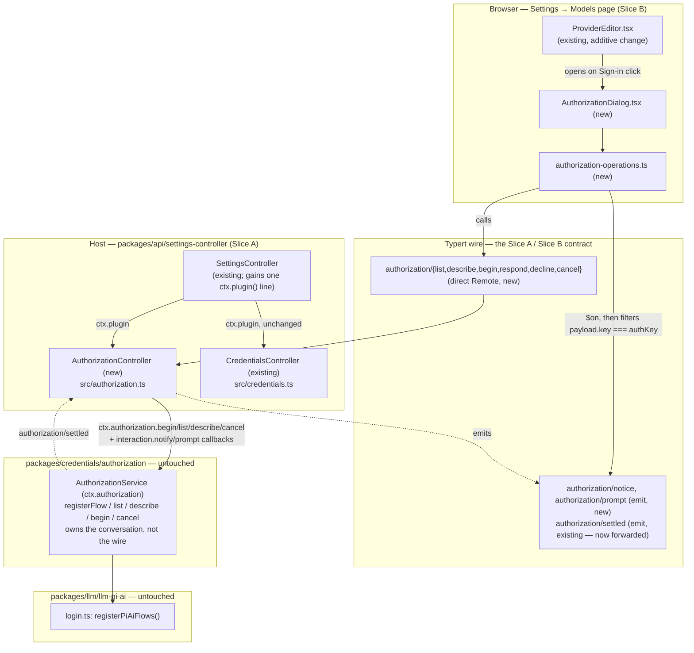
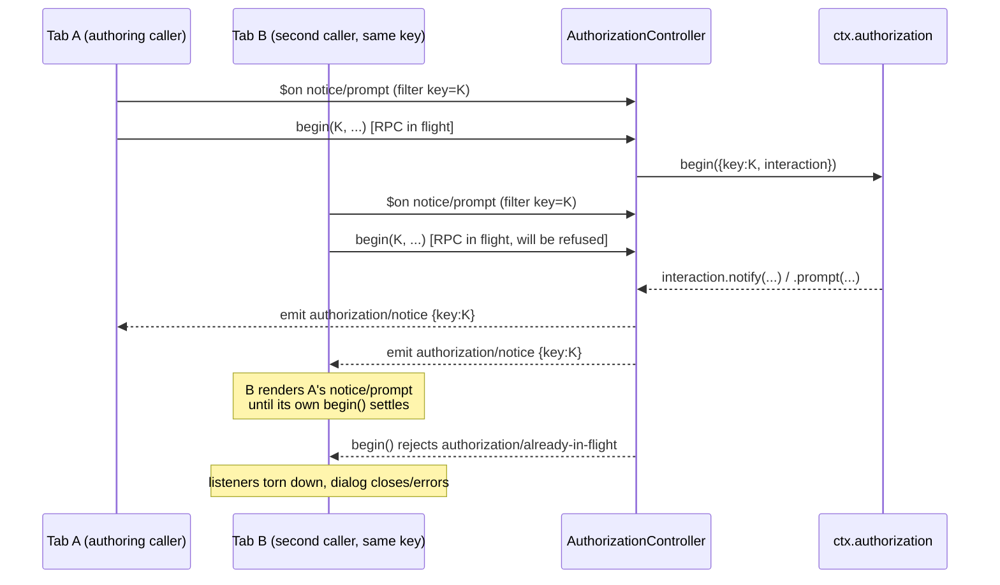

# Agent Note: 通过 ctx.authorization 的浏览器 OAuth 登录与免密钥 web 搜索默认值

Status: proposed

[English](2026-09-01-browser-authorization-and-keyless-web-search.md) | 中文

## Problem

DSH 的顶层 agent（智能体）已经可以完全运行在用户的 Claude Pro/Max 订阅上：已安装的 `@earendil-works/pi-ai` 包中的 `anthropic` 提供方同时声明了 `oauth` 与 `api-key` 两种认证方式，而 `packages/llm/llm-pi-ai/src/login.ts` 中的 `registerPiAiFlows()` 已经为它注册了一个可用的 `ctx.authorization` flow（`loginMethods()`／`registerPiAiFlows()`）。用户的 `settings.yaml` 已经可以通过 `llm-pi-ai` 把 `agent-default-model` 指向 `{ provider: anthropic, model: claude-sonnet-5 }`。

有两处缺口使用户无法*触达*这条 flow，另有第三处缺口使得即便 LLM 默认值修好之后，agent 的另一个 DeepSeek 默认值仍会泄漏到“零 API key”场景中：

1. **没有任何面向客户端的 RPC 暴露 `ctx.authorization`。**`packages/api/remotes` 与 `packages/api/settings-controller` 之下没有任何代码调用 `ctx.authorization.list()`／`.describe()`／`.begin()`／`.cancel()`，因此浏览器无从得知某个提供方存在 `oauth` 方式，更无法驱动登录会话（`packages/credentials/authorization/src/index.ts`、`packages/credentials/authorization/src/types.ts`）。
2. **`ProviderEditor.tsx` 被硬编码为单个只写的 API-key 输入框。**它自己的文件级文档注释说明这是有意保留的最初范围；它从不依据 `AuthorizationMethod[]` 分支，也没有 OAuth 入口（`packages/client/ui-settings-models/src/client/ProviderEditor.tsx`）。
3. **web 搜索工具硬编码默认走 DeepSeek 路由。**`packages/bundle/base/cordis.patch.yml` 固定了 `web.searchProvider: deepseek-official`，并以 `apiKeyEnv: DEEPSEEK_API_KEY` 挂载 `web-search-deepseek`，因此没有 DeepSeek 凭据的部署，在模型调用 `web_search` 的瞬间就会得到带 DeepSeek 色彩的失败，尽管搜索本身并不*要求*必须是 DeepSeek。

本 note 提议用最小的改动、按各子系统既有约定来弥合这三处缺口。

## Proposal

### 1. RPC 契约：向浏览器暴露 `ctx.authorization`

在 `packages/api/settings-controller/src/authorization.ts` 中新增 Host 服务 `AuthorizationController`，其结构与现有的 `CredentialsController`（`packages/api/settings-controller/src/credentials.ts`）完全一致：继承 `TypertRemoteService`，命名空间为 `'authorization'`，由 `SettingsController` 的构造函数通过 `ctx.plugin(AuthorizationController)` 挂载，紧邻 `ctx.plugin(CredentialsController)`。

**线上 key 形态。**每个方法都只接收一个 `key: string`，即拼接后的 `<scope>/<id>` 形式（`llm-pi-ai/anthropic`），而不是 `scope`／`id` 两个参数。控制器在服务端用 seam 自带的 `parseCredentialKey()`（`packages/credentials/credentials/src/index.ts`）重新打上品牌类型，与 `CredentialsController.set()` 用 `credentialRef()` 为普通 `ref: string` 重新打品牌、而不信任线上传来的已打品牌值完全一致。这意味着客户端无需导入品牌化辅助函数：它在 `ProviderEditor.tsx` 中已有 `namespace.ns` 与 `props.provider`，可以直接把 `` `${namespace.ns}/${props.provider}` `` 构造成普通字符串。

```ts
// packages/api/settings-controller/src/authorization.ts

const keySchema = z.string().regex(/^[a-z][a-z0-9-]*\/[a-z][a-z0-9-]*$/)

class AuthorizationController extends TypertRemoteService {
  constructor(ctx: Context) {
    super(ctx, 'authorizationController', { namespace: 'authorization' })
  }

  @Remote
  list(): AuthorizationEntryView[]                                    // no params

  @Remote
  describe(key: string): AuthorizationEntryView | undefined

  @Remote
  begin(key: string, method: string | undefined, signal: AbortSignal): Promise<AuthorizationOutcomeView>

  @Remote
  respond(key: string, promptId: string, value: string): void

  @Remote
  decline(key: string, promptId: string): void

  @Remote
  cancel(key: string): void
}
```

`AuthorizationEntryView` 是把 `@deepseek-ai/dsh-authorization/types` 中的 `AuthorizationEntry` 逐字段投影得到的类型（与 `projectCredentialInfo` 对 `CredentialInfo` 所做的防御性拷贝相同），因此带有意外可枚举属性的 flow 对象不会泄漏到线上。`AuthorizationOutcomeView` 就是原样的 `{ status: 'authorized' | 'cancelled' }`（`AuthorizationOutcome` 本来就可安全上线）。

**错误映射**（在控制器旁声明新的 `RemoteErrorDetailsMap` 条目，模式与 `credentials/rejected` 相同）：

| Seam 抛出／条件 | `RemoteError` 错误码 |
|---|---|
| `AuthorizationError` 错误码 `NO_FLOW` | `authorization/no-flow` |
| `AuthorizationError` 错误码 `UNKNOWN_METHOD` | `authorization/unknown-method` |
| `AuthorizationError` 错误码 `ALREADY_IN_FLIGHT` | `authorization/already-in-flight` |
| `AuthorizationError` 错误码 `NOT_COMMITTED` | `authorization/not-committed` |
| `respond`／`decline` 指定的 `(key, promptId)` 没有待答提示 | `authorization/unknown-prompt` |
| 格式错误的 `key` 字符串 | `gateway/bad-request` |
| `begin()` 自带的 `signal` 已处于中止状态 | `gateway/cancelled` |
| 其他任何情况 | `gateway/internal` |

`cancel(key)` 是**第二个独立的调用**，而非由 `begin()` 自带的 `signal` 派生，因为 `ctx.authorization.cancel()` 自己的文档注释已经点明了这一要求：“请求／响应传输通过第二次调用来应答取消按钮，无法拿到第一次调用的 signal。”`AuthorizationDialog`（见下文）两者都会发出：既中止本地 `begin()` 调用的 `AbortSignal`，*也*调用 `cancel(key)`，因此无论 RPC 传输是否把调用方中止的 signal 转发给进行中的 Host 调用，这一修复都成立。

### 2. 交互桥接：notify／prompt 如何在 `begin()` 进行中到达浏览器

`ctx.authorization.begin()` 是一个长时间运行的异步调用，其 `AuthorizationInteraction.notify()`／`.prompt()` 需要在 RPC 调用仍处于挂起状态时*送达*浏览器，而 `.prompt()` 还需要在 `begin()` 继续之前把答案回传。考虑过两种既有模式，其中一种因一项具体的类型层面发现而被否决：

**已否决：复用 `approval/request`／`user-questions/request` 的 waterfall 转发机制。**追踪了 `packages/typert/protocol/src/types.ts` 中的 `TypertWaterfallEvent`：以 `'waterfall'` 模式转发 Cordis 事件，要求其请求类型满足 `TypertAgentScopedRequest`，即请求对象必须带有类型为 `TypertProjectedContextSubject` 的 `agent` 字段。这是写死在类型层面 `TypertForwardingMode` 中、特定于 Agent 作用域的硬约束，而不是 `approval/request` 碰巧遵循的约定。一次授权尝试没有 `Agent`，它是设置页上的一段会话，因此除非扩展协议层本身来识别一种新的作用域主体，否则无法满足该约束。这是比本任务范围更大、风险更高的改动。

**已采纳：单向 `emit` 事件加一个专用的回传答案 RPC 调用。**两个新的 Cordis 事件，作为 Remote 转发桥接声明在 `packages/api/settings-controller/src/authorization.ts` 本身（**不**放在 `packages/credentials/authorization` 中，后者按其模块文档的说法保持不含任何线上概念：“seam 拥有会话，绝不拥有协议”）：

```ts
declare module '@deepseek-ai/cordis' {
  interface Events {
    /** @mode emit */
    'authorization/notice'(payload: { key: string; notice: AuthorizationNotice }): void
    /** @mode emit */
    'authorization/prompt'(payload: { key: string; promptId: string; prompt: WireAuthorizationPrompt }): void
  }
}
```

`WireAuthorizationPrompt` 是去掉 `signal` 字段的 `AuthorizationPrompt`，因为 `AbortSignal` 无法跨线路传递。控制器在服务端保留真实的 `prompt.signal` 并自行响应它（见下文），因此即使线上发送的对象形状更小，*契约*（“这一个提示可以被撤回而不终止整次尝试”）也得以保留。

已有的 `authorization/settled` 事件（已声明在 `packages/credentials/authorization/src/index.ts` 中）同样以 `'emit'` 模式原样转发，这样当一次尝试（无论从*哪个*标签页发起）结束时，任何打开的标签页的条目／`inFlight` 状态都会刷新。

`AuthorizationController.begin()` 的实现：

```ts
async begin(keyString: string, method: string | undefined, signal: AbortSignal): Promise<AuthorizationOutcomeView> {
  const key = parseKeyOrThrow(keyString)                    // -> gateway/bad-request
  const pending = new Map<string, PromiseWithResolvers<string>>()
  this.pendingByKey.set(key, pending)
  try {
    const outcome = await this.ctx.authorization.begin({
      key, method, signal,
      interaction: {
        notify: (notice) => { this.ctx.emit('authorization/notice', { key, notice }) },
        prompt: (prompt) => {
          const promptId = randomUUID()
          const resolvers = Promise.withResolvers<string>()
          pending.set(promptId, resolvers)
          const wire = { kind: prompt.kind, message: prompt.message, ...restOf(prompt) }  // drop `signal`
          this.ctx.emit('authorization/prompt', { key, promptId, prompt: wire })
          prompt.signal?.addEventListener('abort', () => {
            pending.delete(promptId)
            resolvers.reject(new AuthorizationDeclinedError())   // withdraw just this prompt
          }, { once: true })
          return resolvers.promise
        },
      },
    })
    return outcome
  } catch (error) {
    throw mapAuthorizationError(error)                        // table above
  } finally {
    for (const [, resolvers] of pending) resolvers.reject(new Error('authorization attempt ended'))
    this.pendingByKey.delete(key)
  }
}

respond(keyString: string, promptId: string, value: string): void {
  const key = parseKeyOrThrow(keyString)
  const resolvers = this.pendingByKey.get(key)?.get(promptId)
  if (resolvers === undefined) throw new RemoteError('authorization/unknown-prompt', ..., { key: keyString, promptId })
  this.pendingByKey.get(key)!.delete(promptId)
  resolvers.resolve(value)
}

decline(keyString: string, promptId: string): void {
  const key = parseKeyOrThrow(keyString)
  const resolvers = this.pendingByKey.get(key)?.get(promptId)
  if (resolvers === undefined) throw new RemoteError('authorization/unknown-prompt', ..., { key: keyString, promptId })
  this.pendingByKey.get(key)!.delete(promptId)
  resolvers.reject(new AuthorizationDeclinedError())
}
```

**多标签页正确性。**`emit` 模式转发的事件会广播给每个已连接的客户端，与今天的 `credentials/reference-updated` 相同。每个标签页的客户端监听器按 `payload.key === <该标签页当前正在授权的 key>` 过滤，不匹配则不做任何事，其过滤或忽略的形态与 `packages/client/ui-user-questions/src/client/index.ts`／`packages/client/ui-approval/src/client/index.ts` 中 `answerQuestion`／`answerApproval` 已有的做法相同，只是以 `CredentialKey` 相等而非 Agent 作用域为键。由于 `ctx.authorization.begin()` 已经在进程范围内强制每个 key 同时只有一次尝试，对于给定的 key，任一时刻最多只有一个标签页是合法的应答者，因此除这一过滤之外无需任何仲裁。

### 3. 转发事件白名单与类型再导出

`packages/api/remotes/src/remote-events.ts`：向 `API_REMOTE_FORWARDED_EVENTS` 添加三项：

```ts
{ event: 'authorization/notice', mode: 'emit' },
{ event: 'authorization/prompt', mode: 'emit' },
{ event: 'authorization/settled', mode: 'emit' },
```

`packages/api/remotes/src/client/index.ts`：从 `@deepseek-ai/dsh-authorization/types` 再导出可安全上线的授权类型，方式与今天从 `@deepseek-ai/dsh-credentials/types` 再导出 `CredentialInfo` 相同（`AuthorizationEntry`、`AuthorizationMethod`、`AuthorizationNotice`、`AuthorizationOutcome`、`AuthorizationPrompt`、`AuthorizationPromptOption`、`AuthorizationStatus`），并添加仅类型的 `import type {} from '@deepseek-ai/dsh-authorization/types'`／settings-controller `/remote` 导入，使两个新事件与 `authorization` 命名空间能通过 `ApiRemoteForwardedEvent` 完成类型检查，与 `dsh-user-questions/types` 为 `user-questions/request` 贯通的方式一致。

### 4. 客户端操作层

新增 `packages/client/ui-settings-models/src/client/authorization-operations.ts`，与现有的 `operations.ts` 平行：

```ts
export interface AuthorizationOperations {
  describeAuthorization(key: string): Promise<AuthorizationEntry | undefined>
  beginAuthorization(
    key: string,
    method: string | undefined,
    signal: AbortSignal,
    handlers: {
      onNotice(notice: AuthorizationNotice): void
      onPrompt(promptId: string, prompt: AuthorizationPrompt): void
    },
  ): Promise<AuthorizationOutcome>
  respondAuthorization(key: string, promptId: string, value: string): Promise<string | undefined>
  declineAuthorization(key: string, promptId: string): Promise<string | undefined>
  cancelAuthorization(key: string): Promise<void>
}

export function createAuthorizationOperations(ctx: ClientContext): AuthorizationOperations {
  return {
    describeAuthorization: async (key) => {
      const response = await ctx.remote.authorization.describe(key)
      return response.ok ? response.value : undefined
    },
    beginAuthorization: async (key, method, signal, handlers) => {
      const offNotice = ctx.remote.$on('authorization/notice', (payload) => {
        if (payload.key === key) handlers.onNotice(payload.notice)
      })
      const offPrompt = ctx.remote.$on('authorization/prompt', (payload) => {
        if (payload.key === key) handlers.onPrompt(payload.promptId, payload.prompt)
      })
      try {
        const response = await ctx.remote.authorization.begin(key, method, signal)
        if (!response.ok) throw response.error
        return response.value
      } finally {
        offNotice()
        offPrompt()
      }
    },
    respondAuthorization: async (key, promptId, value) => {
      const response = await ctx.remote.authorization.respond(key, promptId, value)
      return response.ok ? undefined : response.error.message
    },
    declineAuthorization: async (key, promptId) => {
      const response = await ctx.remote.authorization.decline(key, promptId)
      return response.ok ? undefined : response.error.message
    },
    cancelAuthorization: async (key) => {
      await ctx.remote.authorization.cancel(key)
    },
  }
}
```

`packages/client/ui-settings-models/src/client/index.ts`：把 `'remote.authorization'` 加入插件的 `inject`；在 `createModelsOperations(ctx)` 旁绑定 `createAuthorizationOperations(ctx)`，并与 `operations` 一并向下传递；把 `ctx.remote.$on('authorization/settled', refreshModels)` 加入现有的推送失效 disposer 列表，紧邻 `credentials/reference-updated`。

### 5. 客户端 UI 方案：`ProviderEditor.tsx`

更新该文件自己的顶部文档注释：API-key 输入框不再是*唯一*的主要字段；当 pi-ai 布局注册的 flow 声明了 `oauth` 方式时，卡片还会提供 OAuth 入口。密码输入框绝不会被移除或隐藏：任何想使用 API-key 的提供方／用户，仍可无条件地输入 API key。

```ts
// inside ProviderEditor, alongside the existing keyRef/keyState wiring
const authKey = layout === 'pi-ai' ? `${namespace.ns}/${props.provider}` : undefined
const [authEntry, setAuthEntry] = useState<AuthorizationEntry | undefined>(undefined)
const [authDialogOpen, setAuthDialogOpen] = useState(false)

useEffect(() => {
  if (authKey === undefined) { setAuthEntry(undefined); return }
  let stale = false
  void operations.describeAuthorization(authKey).then((entry) => { if (!stale) setAuthEntry(entry) })
  return () => { stale = true }
}, [operations, authKey])
```

仅当 `family === 'pi-ai'` 时，在 `curatedFields` 内、紧挨现有密码 `<input>` 的上方渲染：

- `authEntry === undefined || authEntry.methods.length === 0`：不渲染任何新内容（与今天的行为逐字节一致）。
- 否则渲染一个紧凑的登录行：
  - 只有一种方式（常见情形，pi-ai 的 `anthropic` 提供方只提供 `oauth`）：一个按钮，标签为该方式自带的 `label`（例如“Sign in with Anthropic (Claude Pro/Max)”，该标签本就来自 `packages/llm/llm-pi-ai/src/login.ts` 中的 `oauth.loginLabel ?? oauth.name`，因此这里不新增任何文案）。
  - 多于一种方式：一个小型方式选择器（单选组）加一个“Continue”按钮。
  - `disabled={disabled || authEntry.inFlight}`；`inFlight` 期间，按钮显示类似“Signing in…”，与 `keyLocked` 已对密码字段采用的处理相同。
- 点击会打开 `<AuthorizationDialog>`（新组件，见 §6），传入 `authKey`、所选方式 id、`authEntry.label`、`operations` 与 `t`。
- `AuthorizationDialog` 的 `onClose`：
  - `{ status: 'authorized' }`：重新运行现有的 `describeCredential` effect 与新的 `describeAuthorization` effect（或直接重新调用它们的 setter），让卡片立即反映“已配置”并去掉登录入口的忙碌状态；API-key 字段（`keyDraft`）保持不动，OAuth 登录绝不会写入它。
  - `{ status: 'cancelled' }`：静默关闭，不显示 `failure` 横幅（拒绝是一种结果而非故障，与 seam 自己的契约一致）。
  - 抛出 `RemoteError`：把 `error.message` 显示在卡片已用于设置／凭据写入失败的同一个 `styles['error']` 槽位中，而不是新增错误路径。

### 6. 新组件：`AuthorizationDialog`

`packages/client/ui-settings-models/src/client/AuthorizationDialog.tsx`。

Props：`authKey: string`、`method: string`、`label: string`、`operations: AuthorizationOperations`、`t`、`onClose: (outcome: { status: 'authorized' | 'cancelled' } | undefined) => void`（`undefined` 表示在 `begin()` 结束之前被关闭）。

状态：`notice: AuthorizationNotice | undefined`、`pendingPrompt: { promptId: string; prompt: AuthorizationPrompt } | undefined`、`answerDraft: string`、`busy: boolean`、`failure: string | undefined`。

挂载时：创建一个 `AbortController`；调用 `operations.beginAuthorization(authKey, method, controller.signal, { onNotice: setNotice, onPrompt: (promptId, prompt) => { setPendingPrompt({ promptId, prompt }); setAnswerDraft('') } })`；resolve 时调用 `onClose(outcome)`；reject 时（并非来自本地中止）调用 `setFailure(error.message)`。

渲染：

- `notice.message`；存在时，把 `notice.url` 渲染为真正的 `<a target="_blank" rel="noreferrer">`，并把 `notice.code` 渲染在可复制的 `<code>` 元素中，这正是已确认需求所要求的“打开此 URL、输入此代码”入口。
- 当 `pendingPrompt` 已设置时，按 `prompt.kind` 分别处理：
  - `text`／`secret`：一个带标签的 `<input type={secret ? 'password' : 'text'}>`，绑定 `answerDraft`（占位文字来自 `prompt.placeholder`），一个调用 `operations.respondAuthorization(authKey, promptId, answerDraft)` 的 Submit 按钮，以及一个调用 `operations.declineAuthorization(authKey, promptId)` 的 Decline 按钮。
  - `select`：为每个 `prompt.options[]` 渲染一个按钮，各自直接调用 `respondAuthorization(authKey, promptId, option.id)`（没有单独的提交步骤），外加一个 Decline 按钮。
- 一个常驻的 Cancel 操作：中止本地 controller，**并且**调用 `operations.cancelAuthorization(authKey)`（两者都发出的理由见 §1），然后调用 `onClose(undefined)`。
- 卸载时始终防御性地中止本地 controller，以防父组件重新渲染在流程中途销毁了该对话框。

### Web-search default fix

追踪了 `dsh-tool-web` 自己的模块文档（`packages/web/tool-web/src/index.ts`）：“启用与否控制工具注册；已启用的工具即使在其提供方不可用时仍然可见，并在执行时以结构化错误失败。”这是已有的**有意**的优雅降级设计：`search: true` 时 `web_search` 始终注册，缺少凭据只是单次调用的结构化失败，绝不会在启动时崩溃。更改该契约超出了最小修复的范围。

追踪了 `WebRuntime.search()` 的选择规则（`packages/web/web/src/index.ts`）：*显式配置*的 `searchProvider` id 若解析到一个已注册但不可用的提供方，会抛出带 DeepSeek 色彩的 `WEB_PROVIDER_CONFIGURED_UNAVAILABLE`；而**未**配置 id 时，对已注册提供方的自动选择会在没有任何可用提供方后抛出中性的、与提供方无关的 `WEB_PROVIDER_UNAVAILABLE`（“没有注册任何可用的 web 提供方”），并且从不指责某个特定提供方。

**修复：**在 `packages/bundle/base/cordis.patch.yml` 中，从 `web` 行的 `config:` 里删除 `searchProvider: deepseek-official` 这一行（保留 `fetchProvider: http`，它不需要凭据，本就与提供方无关）。保持 `web-search-deepseek` 行的挂载不变，它仍会自行注册，并在部署提供 `DEEPSEEK_API_KEY`（通过凭据存储或环境变量）的瞬间成为自动选中的提供方，因此已有的 DeepSeek-key 部署行为零变化。完全没有具备搜索能力的凭据的部署，现在 `web_search` 调用会以诚实的 `WEB_PROVIDER_UNAVAILABLE` 失败，而不再是一条明确声称需要 DeepSeek 的消息，而该要求从来就不是承重的。这是一行配置改动；它既不触及 `web-search-deepseek` 的包，也不触及 `tool-web` 或 `ctx.web` 的选择算法。

这里明确**不**尝试、并作为延后工作列出而非臆测的是：真正免密钥、以 Anthropic OAuth 为后盾的搜索提供方。`web-search-deepseek` 自己的提供方已经使用原生的 `web_search_20250305` 服务端工具与“Anthropic 兼容的 Messages API”通信（`packages/web/web-search-deepseek/src/provider.ts`），这在结构上正是真正的 Anthropic 后盾提供方会复用的机制，但它用原始的 `x-api-key`／`Bearer` 字符串认证，而不是可经 OAuth 刷新的访问令牌。把它接到 agent 现在登录所用的同一个 pi-ai `anthropic` OAuth 凭据上，是一项真正的新提供方工作量（令牌刷新、`anthropic-beta` 请求头、自己的凭据解析路径），而不是“最小正确”的修复，因此留作后续工作。

## Pseudocode

```text
// ── Host: packages/api/settings-controller/src/authorization.ts ──────────

module AuthorizationController extends TypertRemoteService:
  state pendingByKey: Map<CredentialKey, Map<promptId, PromiseWithResolvers<string>>>

  function parseKeyOrThrow(raw: string) -> CredentialKey:
    // TEST: describe("not-a-key") rejects with gateway/bad-request
    // TEST: describe("llm-pi-ai/anthropic") parses to credentialKey('llm-pi-ai','anthropic')
    if not KEY_PATTERN.test(raw): throw RemoteError('gateway/bad-request', ...)
    return parseCredentialKey(raw)

  @Remote list() -> AuthorizationEntryView[]:
    // TEST: list() with zero registered flows returns []
    // TEST: list() reflects a flow registered after this controller mounted
    return ctx.authorization.list().map(projectEntry)

  @Remote describe(key: string) -> AuthorizationEntryView | undefined:
    // TEST: describe() for an unregistered key returns undefined (not a throw)
    // TEST: describe() for a registered key returns its methods[] and inFlight
    return ctx.authorization.describe(parseKeyOrThrow(key)) |> map(projectEntry)

  @Remote async begin(key: string, method: string | undefined, signal) -> AuthorizationOutcomeView:
    // TEST: begin() with an already-aborted signal rejects gateway/cancelled, never reaches ctx.authorization.begin()
    // TEST: begin() for a key with no registered flow rejects authorization/no-flow
    // TEST: begin() naming an offered method other than the flow's first uses that method
    // TEST: begin() naming a method the flow does not offer rejects authorization/unknown-method
    // TEST: begin() while another begin() for the same key is in flight rejects authorization/already-in-flight
    // TEST: a flow's notify() during begin() emits exactly one 'authorization/notice' with this call's key
    // TEST: a flow's prompt() during begin() emits exactly one 'authorization/prompt' with a promptId and no `signal` field
    // TEST: begin() resolves { status: 'authorized' } once the flow commits and the seam observes it
    // TEST: a declined prompt (via decline()) makes begin() resolve { status: 'cancelled' }, not throw
    // TEST: begin() resolving/throwing rejects every prompt still pending for this key (no orphaned resolvers)
    // TEST: a NOT_COMMITTED flow rejects authorization/not-committed
    key' = parseKeyOrThrow(key)
    pending = new Map()
    pendingByKey.set(key', pending)
    try:
      outcome = await ctx.authorization.begin({
        key: key', method, signal,
        interaction: {
          notify(notice): ctx.emit('authorization/notice', { key, notice }),
          prompt(prompt):
            promptId = randomUUID()
            resolvers = PromiseWithResolvers<string>()
            pending.set(promptId, resolvers)
            ctx.emit('authorization/prompt', { key, promptId, prompt: dropSignal(prompt) })
            prompt.signal?.addEventListener('abort', once =>
              pending.delete(promptId)
              resolvers.reject(new AuthorizationDeclinedError()))
            return resolvers.promise,
        },
      })
      return outcome
    catch (error): throw mapAuthorizationError(error)
    finally:
      for (_, resolvers) of pending: resolvers.reject(new Error('authorization attempt ended'))
      pendingByKey.delete(key')

  @Remote respond(key: string, promptId: string, value: string) -> void:
    // TEST: respond() for an unknown (key, promptId) rejects authorization/unknown-prompt
    // TEST: respond() resolves the matching begin()'s pending prompt() promise with `value`
    // TEST: respond() consumes the pending entry — a second respond() with the same promptId rejects authorization/unknown-prompt
    resolvers = pendingByKey.get(parseKeyOrThrow(key))?.get(promptId)
    if resolvers is undefined: throw RemoteError('authorization/unknown-prompt', ...)
    delete entry; resolvers.resolve(value)

  @Remote decline(key: string, promptId: string) -> void:
    // TEST: decline() rejects the pending prompt() with AuthorizationDeclinedError, settling begin() as cancelled
    // TEST: decline() for an unknown (key, promptId) rejects authorization/unknown-prompt
    resolvers = pendingByKey.get(parseKeyOrThrow(key))?.get(promptId)
    if resolvers is undefined: throw RemoteError('authorization/unknown-prompt', ...)
    delete entry; resolvers.reject(new AuthorizationDeclinedError())

  @Remote cancel(key: string) -> void:
    // TEST: cancel() on a key with no in-flight attempt is a harmless no-op
    // TEST: cancel() aborts the in-flight begin(), which resolves { status: 'cancelled' }
    ctx.authorization.cancel(parseKeyOrThrow(key))

// ── Client: packages/client/ui-settings-models/src/client/authorization-operations.ts ──

function createAuthorizationOperations(ctx) -> AuthorizationOperations:
  // TEST: describeAuthorization() for an unknown key resolves undefined, never throws
  // TEST: beginAuthorization() subscribes onNotice/onPrompt filtered by key, ignores other keys' events
  // TEST: beginAuthorization() unsubscribes both listeners once the underlying begin() settles (success, throw, or abort)
  // TEST: respondAuthorization()/declineAuthorization() surface the RemoteError message as a string, mirroring storeCredential's contract
  ...

// ── Client: ProviderEditor.tsx additions ──────────────────────────────────

function ProviderEditor(props):
  // TEST: authKey is undefined (no authorization affordance rendered) for family === 'deepseek'
  // TEST: authKey === `${namespace.ns}/${props.provider}` for family === 'pi-ai'
  // TEST: no sign-in affordance renders while authEntry is undefined or methods.length === 0
  // TEST: exactly one button renders labeled with the single method's own label, when methods.length === 1
  // TEST: the sign-in affordance is disabled and shows a busy label while authEntry.inFlight === true
  // TEST: the password <input> remains present, enabled, and independently submittable regardless of authEntry
  // TEST: on AuthorizationDialog onClose({status:'authorized'}), the card re-describes credential+authorization and drops the busy state
  // TEST: on AuthorizationDialog onClose({status:'cancelled'}), no failure banner appears
  // TEST: on AuthorizationDialog onClose(RemoteError-derived failure), the message renders in the existing styles['error'] slot
  ...

// ── Client: AuthorizationDialog.tsx ───────────────────────────────────────

function AuthorizationDialog(props):
  // TEST: mount immediately calls beginAuthorization with the local AbortController's signal
  // TEST: onNotice updates the rendered message/url/code
  // TEST: onPrompt('text'|'secret') renders a labeled input; onPrompt('select') renders one button per option
  // TEST: submitting a text/secret prompt calls respondAuthorization(authKey, promptId, answerDraft)
  // TEST: choosing a select option calls respondAuthorization(authKey, promptId, option.id) directly, no submit step
  // TEST: Decline calls declineAuthorization(authKey, promptId)
  // TEST: Cancel aborts the local signal AND calls cancelAuthorization(authKey), then onClose(undefined)
  // TEST: unmount mid-flow aborts the local controller even if Cancel was never clicked
  ...
```

## Alternatives considered

**把 `authorization/prompt` 作为 Agent 作用域的 waterfall 事件转发，像 `user-questions/request` 那样。**因一项具体的类型层面发现而被否决：`packages/typert/protocol/src/types.ts` 中的 `TypertWaterfallEvent` 要求被转发事件的请求对象带有类型为 `TypertProjectedContextSubject` 的 `agent` 字段。授权尝试没有可提供的 `Agent`，因此满足该要求就意味着要用一种新的非 Agent 作用域类型来扩展 typert 协议，这比新增一对 `emit` 模式事件加两个 `@Remote` 方法的改动大得多、风险也高得多，而所服务的能力（设置页登录）本来就没有可用来界定作用域的 session／agent。

**把拆分的 `scope`／`id` 作为两个线上参数传递，而不是一个拼接的 `key: string`。**因与现有 `CredentialsController` 约定（`ref: string`，在服务端打品牌）不对称，且使每个方法的参数列表翻倍而没有任何行为收益而被否决：客户端在需要构造拼接字符串的地方，本来就同时拥有两段。

**把真实的 `AbortSignal` 对象附在 `notify`／`prompt` 载荷中发送。**不可能：`AbortSignal` 无法跨 Typert 线路序列化。控制器在服务端保留 `prompt.signal` 并在那里响应它，保留了“只撤回这一个提示”的契约，而无需发送对象本身。

**通过在基础 bundle 中彻底禁用 `web-search-deepseek`，或基于 `process.env` 有条件地挂载它，来修复 web 搜索。**被否决：这会使每个已有的 DeepSeek-key 部署倒退（基础 bundle 并非只服务这一位用户），而且静态的、启动时的 `process.env` 检查看不到稍后通过 `.credentials.yaml` 或 Models 页面存入的凭据，而这恰恰是 `web-search-deepseek.available()` 被设计为按每次调用惰性解析的机制。

**现在就构建真正免密钥（Anthropic OAuth 后盾）的搜索提供方。**被否决，因为超出“最小正确改动”的范围：它需要 OAuth 访问令牌刷新和自己的凭据解析路径，而不只是一处配置编辑，上文已将其列为明确的后续工作，而不在此尝试。

## Acceptance criteria

- 浏览器可以列出已注册的授权 flow，看到 `llm-pi-ai/anthropic` 提供 `oauth` 方式，并驱动一次完整的登录（显示带 URL／代码的通知，应答或拒绝任何提示）直至 `{ status: 'authorized' }`，全程无需输入 API key。
- 对于 `deepseek` 布局，以及其 flow 不提供 `oauth` 方式的任何 `pi-ai` 提供方，`ProviderEditor.tsx` 现有密码输入框的行为与之前逐字节一致；API-key 字段在它今天所有可用的地方继续无条件可用。
- 拒绝提示或中途取消，绝不渲染为失败横幅；只有真正的 `RemoteError` 才会。
- 在任何地方都没有配置 DeepSeek 凭据时，agent 正常启动并运行；`web_search` 工具调用以中性的 `WEB_PROVIDER_UNAVAILABLE` 失败，而不是 DeepSeek 专属消息，且不影响其他任何工具或 agent 自身的启动。
- 配置了 `DEEPSEEK_API_KEY` 时，`web_search` 的行为与今天完全一致（自动选择 `web-search-deepseek`，保持不变）。

## Risks

- **范围尚未实现。**按产生本 note 的任务要求，本 note 仅为设计与伪代码；尚未编写或测试任何服务端、客户端或 bundle 代码。伪代码中的 `// TEST:` 锚点是后续实现阶段预期的 TDD 起点，而不是测试通过的证据。
- **本 note 尚未创建 `.zh.md` 对侧文件或 `.i18n.yaml` 伴随记录**，也未针对它运行 `pnpm run verify-agent-note-format`。按本仓库自己的 Agent Note 格式门禁，在按现状合并本 note 之前两者都是必需的；把中文翻译判定为超出规格与伪代码任务的范围，并在此明确列出，而不是悄悄跳过。
- **客户端 `CredentialKey` 的构造是普通字符串模板，而不是品牌化辅助函数。**如果 `AuthorizationController` 在未做完整校验的情况下接受了格式错误的 key，写错的 `namespace.ns`／`provider` 组合可能悄悄指向错误的（或不存在的）flow，而不是大声失败；上文的 `gateway/bad-request` 路径及其测试用例旨在堵上这一缺口，但值得在评审时格外审视。
- **多标签页按 key 相等而非更强的作用域来过滤，属于靠约定保证正确**（与 `answerQuestion`／`answerApproval` 自己的过滤或忽略形态一致），而不是协议层强制的保证。它依赖 `ctx.authorization` 自身“每个 key 同时只有一次尝试”的不变量持续成立；一旦该不变量放宽，这座桥接就需要重新审视。
- **web 搜索修复更改了一个错误码**（`WEB_PROVIDER_CONFIGURED_UNAVAILABLE` → `WEB_PROVIDER_UNAVAILABLE`），影响目前没有 DeepSeek key、且有意或无意地依赖更具体的已配置提供方错误码或其消息文本的部署。这被判断为不太可能（该消息本来就对这类部署具有误导性），但在合并前，值得先 grep 一下现有测试中对 `WEB_PROVIDER_CONFIGURED_UNAVAILABLE` 的断言。

## Architecture review addendum (2026-09-01)

对照本 note 引用的实际源码进行了评审，包括 `CredentialsController`、`AuthorizationService`、`SettingsController`、`TypertForwardingMode`、`remote-events.ts`、`ProviderEditor.tsx`、`ui-user-questions`／`ui-approval` 客户端监听器、`WebRuntime.search()` 与 `cordis.patch.yml`，以确认方案关于边界的论断在实际的类型／模块层面成立，而不只是停留在描述上。结论：**服务边界是健全的，可以干净地拆分为下面两个实现切片。**随后是四项细化，均无需重新设计。

### Component boundary



切片 A／切片 B 的拆分恰好就是中间的线上契约：构建 `AuthorizationDialog.tsx` 的实现者，除了六个 RPC 方法、两个新事件载荷形状以及本 note 中已有的错误码表之外，无需了解 `AuthorizationController` 内部的任何东西，反之亦然。该契约足够稳定，可以并行构建这两个切片。

**已确认边界正确，而不只是看起来合理：**

- `AuthorizationController` 继承 `TypertRemoteService` 并由 `SettingsController` 的构造函数通过 `ctx.plugin(AuthorizationController)` 挂载，与今天 `CredentialsController` 的挂载方式逐字节一致（`packages/api/settings-controller/src/index.ts:107`）。
- 否决 waterfall 转发是真正的死路，而不是风格上的取舍：`TypertWaterfallEvent`（`packages/typert/protocol/src/types.ts:99-108`）要求被转发的请求满足 `TypertAgentScopedRequest`，即带有 `agent: TypertProjectedContextSubject` 字段。授权尝试没有这个字段，因此在不改动协议层的前提下，`'waterfall'` 确实不是选项，这是在类型层面确认的，而非凭空断言。
- 把 `authorization/notice`／`authorization/prompt` 声明在 `packages/api/settings-controller/src/authorization.ts` 而不是 seam 中，不仅在风格上与 seam“拥有会话，绝不拥有协议”的文档注释一致，而且是 seam 边界在 note 未言明的一种不对称下正确工作：**已有的** `authorization/settled` 与 `credentials/reference-updated` 事件*确实*声明在各自的 seam 包内（`packages/credentials/authorization/src/index.ts`、`packages/credentials/credentials/src/types.ts`），因为它们的载荷是纯粹的领域事实（一个品牌化的 `CredentialKey`／`CredentialRef`，没有任何线路形态的东西）。`authorization/notice`／`authorization/prompt` 的载荷则不然：`promptId` 是纯粹为了在无状态 RPC 上回传提示答案而发明的关联 id，而 `WireAuthorizationPrompt` 是专门因为 `signal` 无法跨线路而将其剥离的 `AuthorizationPrompt`。这两种载荷形状在 seam 内部没有意义，因此这对事件被正确地放在比两个先例事件所在位置高一层的地方：同一条 seam 边界，被正确地应用到不同的载荷形状上，而不是不一致地应用。

### Refinements

1. **note 中缺少两条包边界依赖边，若不添加将导致编译失败。**`packages/api/settings-controller/package.json` 目前对等／开发依赖 `@deepseek-ai/dsh-credentials`，但没有依赖 `@deepseek-ai/dsh-authorization`，而 `AuthorizationController` 需要后者来导入 `@deepseek-ai/dsh-authorization/types` 并引用 `ctx.authorization`。`packages/api/remotes/package.json` 的 devDependencies 同样列出了 `@deepseek-ai/dsh-credentials`（用于今天 `src/client/index.ts:103` 处的 `CredentialInfo` 再导出），却没有 `@deepseek-ai/dsh-authorization`，而 §3 计划的 `AuthorizationEntry` 等再导出需要它。两者都是对照现有 `dsh-credentials` 依赖边的一行添加，不属于设计变更，但值得明确说明，免得切片 1 在实现中途才发现。

2. **多标签页过滤或忽略先例的引用不够精确，应在实现者去查找之前予以更正。**§2 引用 `answerQuestion`／`answerApproval`（`packages/client/ui-user-questions/src/client/index.ts`、`packages/client/ui-approval/src/client/index.ts`）作为已在使用“相同的过滤或忽略形态”。检查了两者：它们是 **waterfall** 模式的处理器（`ctx.remote.$on('user-questions/request', function (request, next) {...})`），通过解析 `ctx.sessions.scopeOf(owner)` 来决定是否应答，不属于自己应答时调用 `next()` 交给下一个已注册的处理器／标签页，这是 Cordis 的责任链，而不是在 `emit` 模式监听器内部做普通的 `payload.key === x` 相等检查。没有发现任何现有客户端代码使用后一种形态；最接近的真实类比 `credentials/reference-updated` → `refreshModels`（`packages/client/ui-settings-models/src/client/index.ts:121`）虽是 `emit` 模式，却**完全不**过滤，无论哪个引用发生了变化，每个标签页都无条件刷新。所提议的 `emit` 加 key 相等过滤，是对本代码库 `emit` 模式约定的合理且一致的扩展，但它是一种**新的**过滤形态，而不是复用的。建议改写 §2 的引用（或将其删去），免得切片 2 的实现者在这两个文件里找不到匹配的代码块而一无所获。

3. **一个狭窄但真实（不是假设性）的多标签页竞态，使已列出的“靠约定保证正确”风险更加尖锐。**`beginAuthorization()` 在等待自己的 `begin()` RPC *之前*，就注册了仅按 `payload.key === authKey` 过滤的 `authorization/notice`／`authorization/prompt` 监听器。如果第二个标签页（或同一标签页内的第二次点击）对另一次尝试已在运行的 key 调用 `beginAuthorization()`，那么这第二个调用方的监听器在整个 RPC 往返期间都是活动的、key 匹配正确的，并会收到*第一次*尝试的真实通知／提示，直到它自己的 `begin()` 以 `authorization/already-in-flight` 结束并拆除监听器。`AuthorizationDialog` 会像处理自己的提示一样读取这一窗口期内收到的任何提示，这是一次真实的跨尝试渲染，片刻后会自我纠正，不是安全问题（两个调用方都是已认证用户自己的浏览器），但如果切片 2 想防范它，值得配一张时序图和一个明确的 `// TEST:` 锚点（例如在 `beginAuthorization` 自己的 promise 尚未 reject 之前不渲染 `pendingPrompt`，或者按尝试 id 而不是仅按 key 来门控）。



4. **在所提议的设计中没有发现任何硬编码的密钥、环境变量或凭据值。**检查了完整的 RPC 契约（六个方法，全部以 `key`／`method`／`promptId`／`value: string` 为类型，没有默认值或内嵌值）、两个新事件载荷、`packages/credentials/authorization/src/types.ts` 中的 `AuthorizationEntry` 及相关类型，以及 `packages/bundle/base/cordis.patch.yml` 中 web 搜索修复的那一行改动。范围内唯一形似环境变量的标记，即 `web-search-deepseek` 行上的 `apiKeyEnv: DEEPSEEK_API_KEY`，是已有的*引用名称*（读取哪个环境变量，而不是值），且本 note 明确保持其不变。`respond(key, promptId, value)` 的 `value` 是唯一可能为 `kind: 'secret'` 提示携带用户输入的密钥的字段，它从未出现在错误码表或伪代码错误路径中的任何 `RemoteError` 详情里，这些路径只提到 `key` 与 `promptId`。
